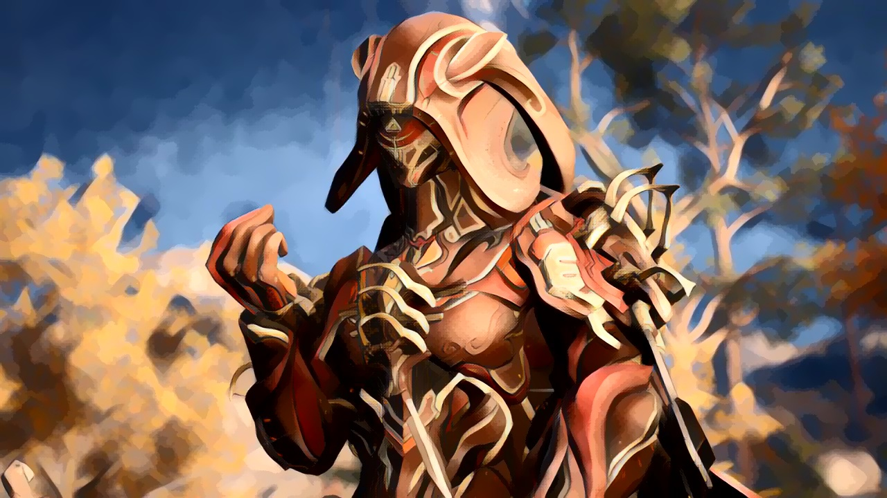

# ColorPreservationYUV
Python implementation of this paper:https://arxiv.org/abs/1606.05897 \
This basically switches the Y component of the YUV colorspace built for Neural Style Transfer. ColorImage colors one image while ColorVideo iterates over all the stylized and unstylized frames in a directory. 

Requirements: \
-opencv-python \
-Sckit Image

Without color preservation: \
.png) \
With color preservation: \

